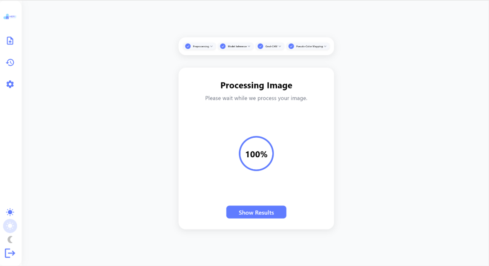
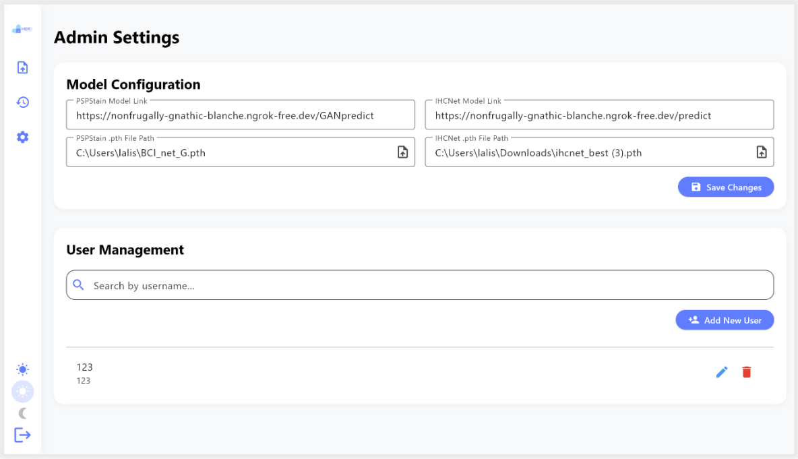
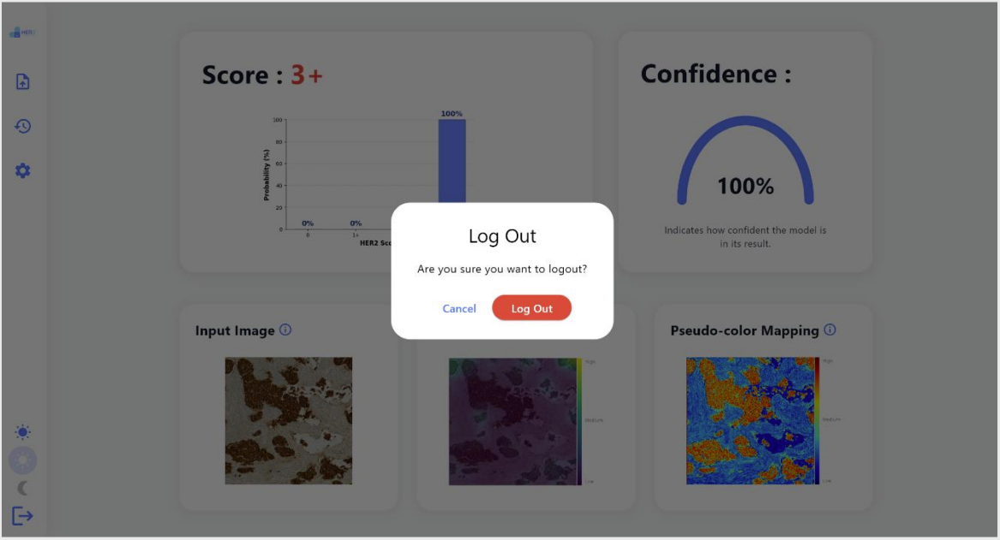
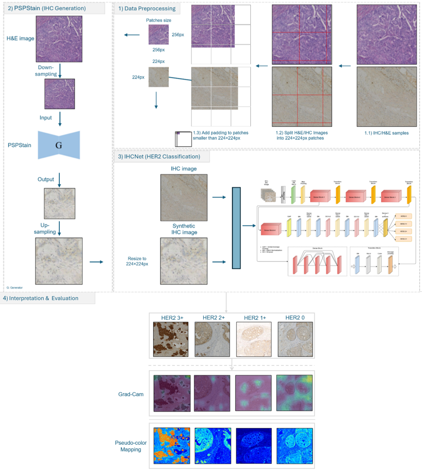

# 🎯 HER2-Classifier — Deep Learning–Based Algorithm for Automated HER2 Scoring

This repository contains a complete deep-learning pipeline for **automated HER2 scoring** from breast-cancer histopathology images.

The system integrates:

- **Virtual Staining (H&E → IHC)** using PSPStain  
- **HER2 multi-class classification** using a modified DenseNet201 (IHCNet)  
- **Synthetic IHC quality filtering** before retraining  
- **Grad-CAM & pseudo-color visualizations**  
- **FastAPI backend**  
- **Flutter mobile application**

---

## 🚀 Project Workflow

1. **Input Image** (H&E or IHC)  
2. If the image is **H&E**, generate **synthetic IHC** using PSPStain  
3. Feed the real/synthetic IHC patch into **IHCNet** → predicts HER2 class: **0, 1+, 2+, 3+**  
4. Backend generates:
   - HER2 score  
   - Confidence probability  
   - Grad-CAM heatmap  
   - Pseudo-color visualization  
   - Synthetic IHC (only if input was H&E)  
5. Flutter app displays the results & stores them in History

---

## 📁 Repository Structure

HER2-Classifier/
│
├── backend/                      # FastAPI backend: PSPStain + IHCNet inference
│   ├── FastAPI.py                # API + model pipeline
│   ├── IHCNet.py                 # Training scripts
│   ├── pspstain.py               # PSPStain evaluation + synthetic filtering
│
├── frontend/                     # Flutter mobile application
│   ├── lib/screens/              # All UI screens Sidebar + shared components
│   ├── lib/theme_provider.dart   # Admin mode + theming
│
├── UI-Screens/                   # Images displayed in this README
│   ├── Login.png
│   ├── Upload image.png
│   ├── Processing page.png
│   ├── Classification Result Page (Synthetic IHC).png
│   ├── History page.png
│   ├── Admin Settings Page.png
│   ├── Logout.png
│   └── System Workflow.png
│
└── README.md
# 🧠 Models

## 1️⃣ IHCNet — HER2 Classifier

- **Backbone:** DenseNet201  
- **Classifier head:**  
  - 512 → 256 → 4 classes  
  - Swish activation  
  - BatchNorm  
  - Dropout  
- **Training phases:**  
  1️⃣ Train on real IHC patches  
  2️⃣ Retrain using real + high-quality synthetic IHC  

### 🔗 Original Implementation  
https://github.com/Sakib-Hossain-Shovon/IHCNet  

### ✅ Our enhancements:
- Reimplemented IHCNet in **PyTorch**  
- Added **Grad-CAM** hooks  
- Added **Pseudo-color mapping**  
- Trained on our dataset → exported weights `.pth`  
- Integrated everything into FastAPI

---

## 2️⃣ PSPStain — Virtual IHC Generator

Translates **H&E patches → synthetic IHC patches**.

### Model Architecture:
- ResNet-based generator  
- 6 residual blocks  
- Instance Normalization  
- Spectral Normalization  
- Input: **256×256 H&E patch**  
- Output: **256×256 synthetic IHC**

### 🔗 Original Implementation  
https://github.com/ccitachi/PSPStain  

### Our PSPStain Workflow:
H&E Patch → PSPStain Generator → Synthetic IHC → IHCNet → HER2 Score

Some architecture references & visuals used in this repo are based on PSPStain + our generated results.

---

# 📊 Dataset (Kaggle)

We used one primary dataset for all experiments.

## 📌 HER2 IHC Patch Dataset (Main Dataset)

Used for:

- Baseline IHCNet training  
- Evaluation  
- Retraining with synthetic data  

### Kaggle Path in Code:
```
DATASET_ROOT = "/kaggle/input/ihc-dataset"
```

### Dataset Link:
https://www.kaggle.com/datasets/linaaskar/ihc-dataset  

Includes labeled HER2 IHC patches: **0, 1+, 2+, 3+**

---

# 🧹 Synthetic IHC Quality Filtering

Before merging synthetic IHC with real IHC for training, we applied strict filtering:

### 1️⃣ Blur Check  
- Laplacian variance  
- If image is blurry → **reject**

### 2️⃣ Brightness / Contrast Check  
Reject images that are:
- Too bright  
- Too dark  
- Low contrast  

### 3️⃣ Confidence Check  
- Pass synthetic IHC → pretrained IHCNet  
- If softmax confidence < **0.55** → **reject**

### 4️⃣ Label Mismatch Check  
If predicted HER2 label ≠ original label → **reject**

### 📉 Final:
- **Rejected:** 85.4%  
- **Accepted:** 14.6% (high-quality only)

Used for IHCNet retraining.

---

# 📈 Performance Summary

## ✅ Baseline IHCNet (Real IHC Only)
- **Accuracy: 93.85%**  
- Strong on classes **0, 2+, 3+**  
- Class **1+** is the hardest (borderline)

## ✅ Retrained IHCNet (Real + Synthetic IHC)
- **Accuracy: 94%**  
- Huge improvement in recall for **1+** and **2+**  
- Lower overfitting → better generalization

## ✅ PSPStain Evaluation (Synthetic Only)
- Accuracy ≈ **71.9%**  
- Synthetic alone isn't perfect  
- But after filtering → excellent augmentation

---

# 📱 Flutter App – Screens

Below are the actual app interfaces used in the system:

### 🔐 Login  


### ⬆️ Upload Image  


### ⚙️ Processing Page  


### 📊 Classification Result  
.png)

### 📜 History  


### 🛠️ Admin Settings  


### 🚪 Logout  


### 🔄 Full System Workflow  


---

# 🔧 Implementation Requirements

## Software
- Python 3.x  
- Google Colab / Jupyter  
- PyTorch  
- OpenCV  
- NumPy & SciPy  
- FastAPI  
- Flutter  
- Grad-CAM Toolkit  

## Hardware
- GPU-enabled environment  
- Large storage for datasets  

---

# ⚙️ Backend (FastAPI)

### Install Dependencies
```bash
pip install fastapi uvicorn torch torchvision opencv-python numpy pillow
```

### Run Server
```bash
uvicorn main:app --host 0.0.0.0 --port 8000
```

### Main Endpoint
`POST /predict-her2`

Returns:
- HER2 class  
- Confidence  
- Grad-CAM heatmap  
- Pseudo-color visualization  
- Synthetic IHC (if input was H&E)

---

## 👩‍💻 Project Team

| Team Members |
|--------------|
| **Lina Askar** |
| **Farah Basmaih** |
| **Najla Almaghlouth** |
| **Lama Alghofaili** |
| **Kholoud Alkenani** |
| **Supervisor: Dr. Najah Alsubaie** |


---

# 🔮 Future Work
- Integrate **Vision Transformers (ViTs)**  
- Expand from patch-based inference → **whole-slide analysis**  
- Deploy a clinical-grade API  
- Multi-biomarker digital pathology  

---

# 🔒 License
This project is for academic and research use only.  
Please cite **IHCNet**, **PSPStain**, and **this repository** if used.
```
